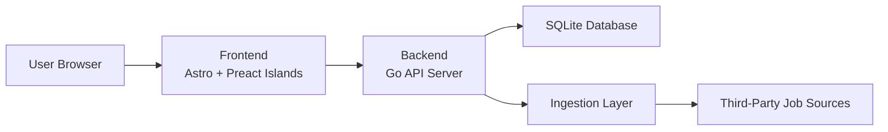
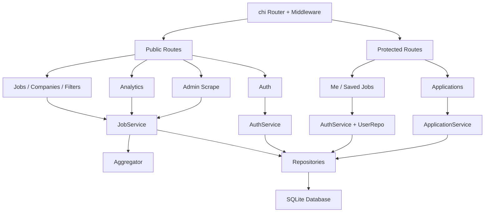
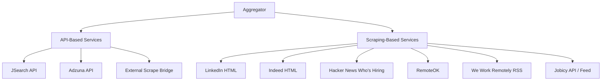

# JobPulse Architecture Reference

This document covers the architecture of JobPulse in three focused views:

1. Overall architecture: how the frontend and backend connect
2. Backend architecture: how API routes map to backend services
3. Service integration architecture: how ingestion is split between API-based services and scraping-based services

Each section includes:

- a short explanation
- a Mermaid diagram
- a raw Mermaid code block for reuse

## 1. Overall Architecture

### 1.1 Summary

At the system level, JobPulse is a full-stack web application with:

- an Astro frontend
- a Go backend API
- a SQLite database
- an ingestion layer that pulls jobs from third-party providers

The frontend is responsible for rendering pages and triggering API calls. The backend is responsible for routing, authentication, orchestration, persistence, analytics, and source aggregation.

In single-container mode:

- Astro runs internally
- Go serves the public HTTP port
- Go reverse-proxies frontend page requests to Astro

### 1.2 Overall Architecture Diagram

### 1.3 Overall Architecture Mermaid Code

## 2. Backend Architecture

### 2.1 Summary

The backend is organized around HTTP routes, handlers, services, and repositories.

Route flow:

1. A request enters the `chi` router.
2. Middleware handles logging, recovery, CORS, compression, and auth extraction.
3. A route is dispatched to a handler.
4. The handler calls the appropriate service.
5. Services read/write repositories and optionally trigger ingestion or analytics logic.
6. Repositories persist and query SQLite.

### 2.2 Route-to-Service Mapping

The route groups map to services like this:

| Route group | Main responsibility | Service layer |
|---|---|---|
| `/api/v1/jobs`, `/api/v1/companies`, `/api/v1/filters` | job browsing and catalog reads | `JobService` |
| `/api/v1/analytics/*` | summary, skills, trends, source health, salary stats | `JobService` |
| `/api/v1/admin/scrape/{source}` | manual source refresh | `JobService` via `Aggregator` |
| `/api/v1/auth/*` | registration, login, logout, session | `AuthService` |
| `/api/v1/me` and `/api/v1/me/saved-jobs/*` | profile and saved jobs | `AuthService` + `UserRepo` |
| `/api/v1/me/applications/*` | application tracker | `ApplicationService` |

### 2.3 Backend Architecture Diagram

### 2.4 Backend Architecture Mermaid Code

## 3. Service Integration Architecture

### 3.1 Summary

The ingestion architecture is centered around the `Aggregator`, which fans out search requests across enabled providers.

These providers are intentionally split into two types:

- API-based services
- scraping-based services

This separation matters because:

- API-based providers are generally more structured and stable
- scraping-based providers are more fragile and parser-dependent

### 3.2 API-Based Services

These integrations call external APIs or bridge endpoints:

- `JSearch`
- `Adzuna`
- `Scrape Bridge`

### 3.3 Scraping-Based Services

These integrations use scraping, feed parsing, or scraper-style extraction:

- built-in `LinkedIn` HTML scraper
- built-in `Indeed` HTML scraper
- `Hacker News Who's Hiring`
- `RemoteOK`
- `We Work Remotely`
- `Jobicy`

### 3.4 Service Integration Diagram

### 3.5 Service Integration Mermaid Code

## 4. Supporting Notes

### 4.1 Overall architecture takeaway

The frontend and backend are cleanly separated, but the backend is the real operational center of the product.

### 4.2 Backend architecture takeaway

The backend is route-driven, with handlers dispatching to:

- `JobService`
- `AuthService`
- `ApplicationService`

and then into repositories, aggregation logic, and SQLite.

### 4.3 Service integration takeaway

The ingestion layer is unified behind one aggregator, but internally split into:

- API-based providers
- scraping-based providers

This gives the rest of the system one unified job domain model while keeping source complexity isolated at the integration boundary.
