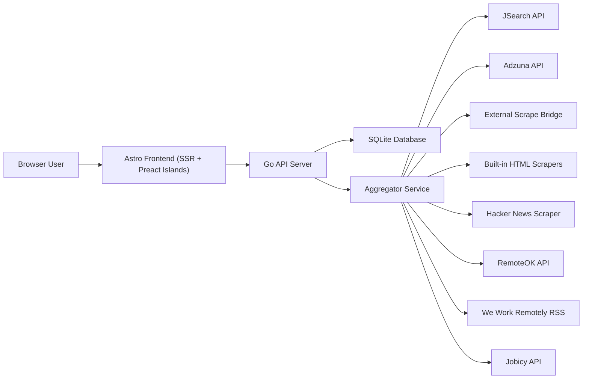
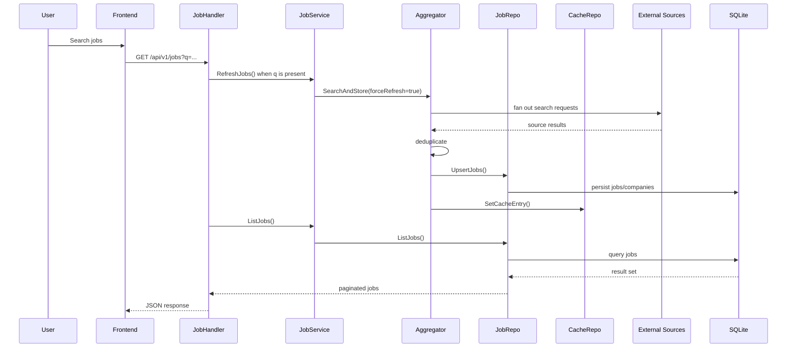

# JobPulse Project Reference

This document maps the current codebase in detail so future contributors can understand how the system is structured, what it does today, where data lives, how requests flow through the stack, and which parts are production-facing versus partial or dormant.

## 1. Project Overview

### Product purpose

JobPulse is a full-stack job aggregation and job-tracking application. It combines:

- A Go backend API
- An Astro SSR frontend with Preact islands
- A SQLite database for persistence
- Multiple ingestion paths for external job data
- Cookie-based authentication
- Saved jobs, company browsing, analytics, and a lightweight application tracker

### Core responsibilities

The platform currently does five main jobs:

1. Aggregates jobs from multiple external sources and stores them locally.
2. Exposes a REST API for jobs, companies, analytics, authentication, saved jobs, and applications.
3. Renders a server-side frontend backed by the same API.
4. Tracks user-specific state such as bookmarks and applications.
5. Periodically refreshes configured search queries into the local database.

### High-level architecture



### Runtime topology

In local development, the backend and frontend can run separately:

- Go API on `:8080`
- Astro dev server on `:4321`

In containerized mode, the app runs as a single service:

- Astro runs internally on `127.0.0.1:4321`
- Go runs publicly on `0.0.0.0:8080`
- Go reverse-proxies all non-API routes to the Astro server

## 2. Repository Map

### Top-level layout

| Path | Purpose |
|---|---|
| `cmd/server` | Backend application entry point |
| `internal/api` | Router, middleware, handlers, embedded OpenAPI spec |
| `internal/config` | Environment loading and runtime configuration |
| `internal/database` | SQLite bootstrap and embedded migrations |
| `internal/domain` | Shared backend domain models |
| `internal/repository` | Database access layer |
| `internal/service` | Business logic and orchestration |
| `internal/sources` | Source interface and source clients |
| `internal/scraper` | Additional scrapers and parsing helpers |
| `frontend` | Astro application with Preact islands |
| `docs` | Supporting documentation |
| `Dockerfile` | Single-container production build |
| `docker-compose.yml` | Single-service local orchestration |
| `start.sh` | Container entrypoint starting Astro then Go |

### Backend package map

| Package | Responsibility |
|---|---|
| `internal/config` | Reads `.env`, parses booleans/durations/lists, builds `Config` |
| `internal/database` | Opens SQLite, enables WAL and foreign keys, runs embedded SQL migrations |
| `internal/domain` | Defines `Job`, `Company`, `User`, `Application`, analytics DTOs, cache/trend models |
| `internal/repository` | Encapsulates SQL for jobs, companies, users, bookmarks, cache, trends, applications |
| `internal/service` | Coordinates repositories and sources; owns auth, aggregation, analytics refresh, live sync |
| `internal/api` | Builds chi router, docs endpoints, auth middleware, JSON handlers |
| `internal/sources` | Shared `JobSource` interface, stable ID helper, source-specific clients |
| `internal/scraper` | HN, RemoteOK, We Work Remotely, Jobicy scrapers plus HTML/text helpers |

### Frontend map

| Path | Responsibility |
|---|---|
| `frontend/src/pages` | Route-level Astro pages |
| `frontend/src/layouts` | Shared page, auth, and base layouts |
| `frontend/src/components/common` | Header, footer, search, pagination, empty states |
| `frontend/src/components/jobs` | Job-specific presentation components |
| `frontend/src/components/islands` | Interactive Preact components |
| `frontend/src/lib/api.ts` | API client wrapper and endpoint helpers |
| `frontend/src/lib/job-ui.ts` | UI formatting helpers |
| `frontend/src/lib/compare-store.ts` | In-memory comparison state |
| `frontend/src/types` | Frontend TypeScript models |
| `frontend/src/styles/global.css` | Global design tokens and shared utility classes |

## 3. Application Startup and Wiring

### Backend startup sequence

The main server boot flow in `cmd/server/main.go` is:

1. Load config from environment and optional `.env`.
2. Open SQLite database.
3. Enable PRAGMAs:
   - `journal_mode=WAL`
   - `foreign_keys=ON`
   - `busy_timeout=5000`
4. Run embedded migrations.
5. Run database cleanup seeding logic.
6. Create repositories:
   - `JobRepo`
   - `UserRepo`
   - `CacheRepo`
   - `TrendsRepo`
   - `ApplicationRepo`
7. Conditionally create source clients based on config.
8. Build an `Aggregator` if at least one source is enabled.
9. Create services:
   - `JobService`
   - `AuthService`
   - `ApplicationService`
10. Start the background live-sync worker if configured.
11. Create HTTP handlers and router.
12. Start the HTTP server.

### Source enablement rules

Source enablement is configuration-driven:

| Source | Enablement rule |
|---|---|
| `jsearch` | `JSEARCH_API_KEY` must be set |
| `adzuna` | `ADZUNA_APP_ID` and `ADZUNA_APP_KEY` must be set |
| `scrape_bridge` | `SCRAPE_BRIDGE_URL` must be set |
| `linkedin`, `indeed` built-in HTML scrapers | `ENABLE_BUILTIN_SCRAPERS=true` and provider included in `BUILTIN_SCRAPER_SOURCES` |
| `hn_hiring` | Enabled unless `DISABLE_HN_SCRAPER=true` |
| `remoteok` | Enabled unless `DISABLE_REMOTEOK_SCRAPER=true` |
| `weworkremotely` | Enabled unless `DISABLE_WWR_SCRAPER=true` |
| `jobicy` | Enabled unless `DISABLE_JOBICY_SCRAPER=true` |

### Container startup sequence

`start.sh` does the following:

1. Starts Astro’s standalone server on `127.0.0.1:${FRONTEND_PORT}`.
2. Sets `FRONTEND_SERVER_URL` to that internal URL.
3. Starts the Go server on the public port.
4. Lets Go proxy frontend routes.

This means the Go server remains the public edge of the application in container mode.

## 4. Architecture by Layer

### 4.1 Presentation layer

The presentation layer is split between:

- Astro SSR pages for initial page generation
- Preact islands for interactive widgets
- Go HTTP handlers for the REST API

The frontend is not a separate SPA. Pages are server-rendered by Astro, then enhanced with client-side islands where needed.

### 4.2 API layer

The API layer uses:

- `chi` for routing
- `cors` middleware
- logging, recovery, compression, strip-slash, and rate-limit middleware
- JWT parsing middleware that supports both `Authorization: Bearer` and a cookie

### 4.3 Service layer

The main service responsibilities are:

| Service | Responsibility |
|---|---|
| `JobService` | Read jobs/companies/analytics, trigger refreshes, expose source health |
| `AuthService` | Register users, validate login, hash passwords, mint JWTs |
| `ApplicationService` | CRUD for application tracker records |
| `Aggregator` | Fan-out live searches across sources through a bounded worker pool, deduplicate, persist, maintain source health |
| `LiveSyncWorker` | Periodically runs configured refresh jobs and recomputes trends |

### 4.4 Repository layer

Repositories are thin SQL adapters. They do not own orchestration; they mainly translate between domain models and SQLite.

### 4.5 Data layer

Data is stored in a single SQLite file. The database serves four distinct roles:

1. Primary persistence for jobs and companies
2. User/account persistence
3. Search freshness cache
4. Analytical snapshot storage

## 5. Data Storage and State

### Storage types used in the project

| Storage type | Where used | Contents |
|---|---|---|
| SQLite file | `DATABASE_PATH` | Jobs, companies, users, bookmarks, search cache, market trends, applications |
| Embedded filesystem | Go binary | SQL migrations and `openapi.json` |
| HTTP-only cookie | Browser | JWT session token under `jobhuntly_session` |
| In-memory frontend state | Browser | Job comparison selections via `compare-store` |
| Browser localStorage | Browser | Theme preference in dormant `ThemeToggle` component |
| Docker volume | Container runtime | Persistent SQLite database at `/data/jobpulse.db` |
| Environment variables | Backend + frontend runtime | Config, API keys, routing, background sync settings |

### Persistence model

The database is local-first. External jobs are fetched live, normalized, and then stored locally. Most user-facing reads ultimately come from SQLite even after a refresh.

### Caching model

Search freshness is tracked using the `search_cache` table rather than a memory cache. The cache key is a SHA-256-derived deterministic key built from:

- query
- location
- page

This lets refresh logic survive process restarts.

### Session model

Authentication uses JWTs signed with `JWT_SECRET`. The token is stored in a cookie:

- name: `jobhuntly_session`
- `HttpOnly`
- `SameSite=Lax`
- `Secure` only when request is TLS-backed

Persistent sessions are implemented by setting cookie expiry to 30 days when `rememberMe=true`.

## 6. Database Schema

### 6.1 `users`

Purpose: registered account storage.

| Column | Type | Notes |
|---|---|---|
| `id` | `TEXT` | Primary key, UUID |
| `email` | `TEXT` | Unique login identifier |
| `password_hash` | `TEXT` | bcrypt hash |
| `name` | `TEXT` | Display name |
| `created_at` | `DATETIME` | Creation timestamp |
| `updated_at` | `DATETIME` | Update timestamp |

### 6.2 `jobs`

Purpose: canonical locally stored job catalog, regardless of source.

| Column | Type | Notes |
|---|---|---|
| `id` | `TEXT` | Primary key, stable deterministic job ID |
| `external_id` | `TEXT` | Upstream source ID when available |
| `title` | `TEXT` | Job title |
| `description` | `TEXT` | Full or partial description |
| `company` | `TEXT` | Company display name |
| `company_slug` | `TEXT` | Slug used in frontend routes |
| `location` | `TEXT` | Raw/normalized location string |
| `salary_min` | `INTEGER` | Optional |
| `salary_max` | `INTEGER` | Optional |
| `salary_currency` | `TEXT` | Defaults to `USD` |
| `posted_at` | `DATETIME` | Upstream publish time or inferred time |
| `expires_at` | `DATETIME` | Optional expiry |
| `source` | `TEXT` | Source identifier |
| `source_url` | `TEXT` | Original apply/details link |
| `skills` | `TEXT` | JSON array stored as text |
| `is_remote` | `BOOLEAN` | Remote flag |
| `employment_type` | `TEXT` | Full-time, contract, internship, etc. |
| `experience_level` | `TEXT` | Optional string |
| `created_at` | `DATETIME` | Insert time |
| `updated_at` | `DATETIME` | Last upsert time |

Indexes:

- `idx_jobs_source`
- `idx_jobs_company_slug`
- `idx_jobs_posted_at`
- `idx_jobs_experience_level`
- `idx_jobs_location`
- `idx_jobs_is_remote`
- `idx_jobs_salary_min`
- `idx_jobs_salary_max`
- `idx_jobs_employment_type`

### 6.3 `companies`

Purpose: company profile storage and company-route backing data.

| Column | Type | Notes |
|---|---|---|
| `slug` | `TEXT` | Primary key |
| `name` | `TEXT` | Company name |
| `industry` | `TEXT` | Optional industry |
| `description` | `TEXT` | Often auto-generated from source when first created |
| `website` | `TEXT` | Optional |
| `logo_url` | `TEXT` | Optional |
| `job_count` | `INTEGER` | Stored count, but detail responses recompute from jobs |
| `created_at` | `DATETIME` | Creation timestamp |

### 6.4 `search_cache`

Purpose: freshness tracking for live searches.

| Column | Type | Notes |
|---|---|---|
| `query_hash` | `TEXT` | Primary key |
| `query_text` | `TEXT` | Human-readable query |
| `filters` | `TEXT` | JSON-ish filter text, default `{}` |
| `result_count` | `INTEGER` | Latest stored result count |
| `fetched_at` | `DATETIME` | Last refresh time |

### 6.5 `saved_jobs`

Purpose: user bookmarks.

| Column | Type | Notes |
|---|---|---|
| `user_id` | `TEXT` | FK to users |
| `job_id` | `TEXT` | FK to jobs |
| `saved_at` | `DATETIME` | Save timestamp |

Constraints:

- Composite primary key `(user_id, job_id)`
- `ON DELETE CASCADE` from `users`
- `ON DELETE CASCADE` from `jobs`

Indexes:

- `idx_saved_jobs_user_id`

### 6.6 `market_trends`

Purpose: snapshot-based skill analytics.

| Column | Type | Notes |
|---|---|---|
| `id` | `INTEGER` | Autoincrement primary key |
| `skill_name` | `TEXT` | Lowercased skill key |
| `mention_count` | `INTEGER` | Number of mentions in current snapshot |
| `avg_salary_min` | `INTEGER` | Optional average min salary for skill |
| `avg_salary_max` | `INTEGER` | Optional average max salary for skill |
| `snapshot_date` | `DATE` | Snapshot partition key |
| `created_at` | `DATETIME` | Insert timestamp |

Indexes:

- `idx_market_trends_date`
- `idx_market_trends_skill`

### 6.7 `applications`

Purpose: personal application tracker.

| Column | Type | Notes |
|---|---|---|
| `id` | `TEXT` | Primary key, UUID |
| `user_id` | `TEXT` | Owner |
| `job_id` | `TEXT` | Optional FK to known job |
| `title` | `TEXT` | Position title |
| `company` | `TEXT` | Company label |
| `status` | `TEXT` | `wishlist`, `applied`, `interviewing`, `offered`, `rejected` |
| `notes` | `TEXT` | Free-form notes |
| `applied_at` | `DATETIME` | Optional applied date |
| `created_at` | `DATETIME` | Creation time |
| `updated_at` | `DATETIME` | Update time |

Constraints:

- `user_id` cascades on delete
- `job_id` is set to null if underlying job disappears

Indexes:

- `idx_applications_user`
- `idx_applications_status`

## 7. Domain Models

### Job-related models

| Model | Purpose |
|---|---|
| `domain.Job` | Full job detail model for DB and detail responses |
| `domain.JobSummary` | Slimmed-down list card model |
| `domain.Company` | Company entity |
| `domain.JobQueryParams` | Internal search/filter contract |
| `domain.FilterOptions` | Available filter values returned to the frontend |
| `domain.StringSlice` | JSON-backed string slice for SQLite text columns |

Important model behavior:

- Skills are stored as JSON text in SQLite but exposed as arrays in Go and TypeScript.
- Salary is represented as flat min/max/currency fields rather than a nested DB object.
- Pagination metadata is generated server-side.

### Auth models

| Model | Purpose |
|---|---|
| `domain.User` | Stored user record |
| `domain.RegisterRequest` | Registration payload |
| `domain.LoginRequest` | Login payload |
| `domain.AuthResponse` | JWT plus user returned after auth |
| `domain.SessionResponse` | Current session status |

### Application tracker models

| Model | Purpose |
|---|---|
| `domain.Application` | Stored application entry |
| `domain.ApplicationCreate` | Create payload |
| `domain.ApplicationUpdate` | Partial update payload |

### Analytics models

| Model | Purpose |
|---|---|
| `domain.AnalyticsSummary` | Top-level stats |
| `domain.SkillCount` | Top skills counts |
| `domain.MarketTrend` | Latest skill snapshot points |
| `domain.SourceDistribution` | Count of jobs per source |
| `domain.SourceHealth` | Operational source status |
| `domain.SalaryStats` | Aggregate salary metrics |

## 8. Data Flows

### 8.1 Job search request flow



Important details:

- Live refresh is only triggered when `q` is present and `refresh` is not explicitly `false`.
- Handler refresh currently passes an empty location string.
- If the DB query returns zero rows but live refresh returned jobs, the handler falls back to summarizing the refreshed jobs directly.

### 8.2 Aggregation and deduplication flow

The aggregator:

1. Builds a cache key from query/location/page.
2. Checks `search_cache` freshness unless force refresh is requested.
3. Launches one goroutine per source with a 30-second timeout.
4. Collects results and per-source errors.
5. Updates `SourceHealth` bookkeeping.
6. Deduplicates jobs by lowercase `title + "|" + company`.
7. Upserts jobs.
8. Upserts companies extracted from those jobs.
9. Updates the cache entry.

If all sources fail:

- it attempts a DB fallback using cached stored jobs
- otherwise returns an aggregated error

### 8.3 Background live sync flow

The `LiveSyncWorker` is optional and only runs when:

- an aggregator exists
- at least one `LIVE_SYNC_QUERIES` entry exists
- interval is greater than zero

Flow:

1. Optionally sync on startup.
2. Loop every `LIVE_SYNC_INTERVAL`.
3. For each query and each location:
   - call `RefreshJobs`
   - use a 30-second timeout per fetch
4. After finishing all configured refreshes:
   - recompute market trends

### 8.4 Manual source refresh flow

The analytics page triggers manual refreshes from the browser:

1. `POST /api/v1/analytics/refresh`
2. Sequential `POST /api/v1/admin/scrape/{source}` for:
   - `hn_hiring`
   - `remoteok`
   - `jobicy`
   - `weworkremotely`

Each individual source card also calls `POST /api/v1/admin/scrape/{source}`.

## 9. Backend Feature Map

### 9.1 Jobs

Implemented capabilities:

- Paginated job listing
- Full job detail retrieval
- Free-text search against title, company, and skills JSON text
- Filters for:
  - experience
  - source
  - salary minimum
  - remote-only
  - employment type
- Sort modes:
  - newest
  - oldest
  - salary descending
  - salary ascending
- Source-backed live refresh on user search

Notable implementation details:

- The repository supports a `location` filter, but the current HTTP handler does not populate it from query params.
- Sort alias `relevance` is mapped to newest-first; there is no true relevance ranking.

### 9.2 Companies

Implemented capabilities:

- Company list page
- Company detail page
- Company-specific jobs
- Company-specific skill aggregation from its jobs

Company records are sometimes auto-generated from ingested jobs, so descriptions may be placeholders such as `Hiring on <source>`.

### 9.3 Authentication

Implemented capabilities:

- Register
- Login
- Logout
- Session status check
- Current profile lookup

Validation rules:

- Email must parse as valid email
- Name must be at least 2 characters
- Password must be at least 8 chars and include letters and numbers

Not implemented:

- Email verification
- Password reset
- Account update flow
- Role-based access control

### 9.4 Saved jobs

Implemented capabilities:

- Save a job
- Unsave a job
- List all saved jobs for the current user

### 9.5 Application tracker

Implemented capabilities:

- List tracked applications
- Create manual or job-linked application records
- Update status, notes, and applied date
- Delete applications

### 9.6 Analytics

Implemented capabilities:

- Summary totals
- Top skills
- Latest trend snapshot
- Source distribution
- Source health
- Salary statistics
- Manual trend recomputation

### 9.7 Source monitoring

Each source tracks operational state in memory:

- healthy / unhealthy
- last query
- last error
- last attempt time
- last success time
- last duration
- current database-backed job count for that source

## 10. API Reference

### Non-versioned routes

| Method | Path | Auth | Purpose |
|---|---|---|---|
| `GET` | `/health` | No | Health check returning `{"status":"ok"}` |
| `GET` | `/docs` | No | Swagger UI |
| `GET` | `/openapi.json` | No | Embedded OpenAPI spec |

### Auth routes

| Method | Path | Auth | Request body | Response |
|---|---|---|---|---|
| `POST` | `/api/v1/auth/register` | No | `email`, `password`, `name`, `rememberMe` | `AuthResponse` and session cookie |
| `POST` | `/api/v1/auth/login` | No | `email`, `password`, `rememberMe` | `AuthResponse` and session cookie |
| `POST` | `/api/v1/auth/logout` | No | None | `{ "message": "logged out" }` and cookie cleared |
| `GET` | `/api/v1/auth/session` | Optional | None | `SessionResponse` |

### Job routes

| Method | Path | Auth | Purpose |
|---|---|---|---|
| `GET` | `/api/v1/jobs` | Optional | List jobs |
| `GET` | `/api/v1/jobs/{id}` | Optional | Get one job |
| `GET` | `/api/v1/filters` | No | Get available filters |

`GET /api/v1/jobs` query parameters currently honored by the handler:

| Param | Meaning |
|---|---|
| `q` | Search query |
| `page` | Page number |
| `limit` | Page size, clamped to `1..100` |
| `experience` | Experience-level filter |
| `source` | Source filter |
| `employment_type` | Employment-type filter |
| `salary_min` | Minimum salary threshold |
| `remote` | `true` or `false` |
| `sort` | `relevance`, `date`, `salary`, `date_asc`, `salary_desc`, `salary_asc` |
| `refresh` | Set to `false` to skip live refresh when `q` is present |

Response shape:

```json
{
  "data": [/* JobSummary[] */],
  "pagination": {
    "page": 1,
    "limit": 20,
    "totalItems": 123,
    "totalPages": 7,
    "hasMore": true
  }
}
```

### Company routes

| Method | Path | Auth | Purpose |
|---|---|---|---|
| `GET` | `/api/v1/companies` | No | List companies |
| `GET` | `/api/v1/companies/{slug}` | No | Get company detail and jobs |

`GET /api/v1/companies` query parameters:

- `q`: company name search

`GET /api/v1/companies/{slug}` response:

```json
{
  "company": {/* Company */},
  "jobs": [/* JobSummary[] */],
  "realSkills": [/* string[] */]
}
```

### Analytics routes

| Method | Path | Auth | Purpose |
|---|---|---|---|
| `GET` | `/api/v1/analytics/skills` | No | Top skills |
| `GET` | `/api/v1/analytics/summary` | No | Summary stats |
| `GET` | `/api/v1/analytics/trends` | No | Latest trends snapshot |
| `GET` | `/api/v1/analytics/sources` | No | Source distribution |
| `GET` | `/api/v1/analytics/source-health` | No | Live source status |
| `GET` | `/api/v1/analytics/salary` | No | Salary stats |
| `POST` | `/api/v1/analytics/refresh` | No | Recompute trends snapshot |

Query parameters:

- `skills?limit=n`
- `trends?limit=n`

### Current user routes

All `/api/v1/me/**` routes require authentication.

| Method | Path | Purpose |
|---|---|---|
| `GET` | `/api/v1/me` | Current profile |
| `GET` | `/api/v1/me/saved-jobs` | Saved jobs list |
| `POST` | `/api/v1/me/saved-jobs/{id}` | Save job |
| `DELETE` | `/api/v1/me/saved-jobs/{id}` | Unsave job |
| `GET` | `/api/v1/me/applications` | List applications |
| `POST` | `/api/v1/me/applications` | Create application |
| `PATCH` | `/api/v1/me/applications/{id}` | Update application |
| `DELETE` | `/api/v1/me/applications/{id}` | Delete application |

Application create payload:

```json
{
  "jobId": "optional-job-id",
  "title": "Backend Engineer",
  "company": "Acme",
  "status": "wishlist",
  "notes": "Optional notes",
  "appliedAt": "optional ISO timestamp"
}
```

Application patch payload is partial:

```json
{
  "status": "interviewing",
  "notes": "Updated notes",
  "appliedAt": "optional ISO timestamp"
}
```

### Admin route

| Method | Path | Auth | Purpose |
|---|---|---|---|
| `POST` | `/api/v1/admin/scrape/{source}` | No | Trigger a focused scrape of one source |

Important note:

- This route is not currently protected by authentication or authorization middleware.

## 11. Frontend Screen Map

### `/`

Purpose:

- Marketing-style landing page
- Highlights featured jobs, companies, skills, and summary data

Data fetched server-side:

- jobs (`fetchJobs({ limit: 8 })`)
- companies
- analytics summary
- filters
- top skills

Key UI elements:

- hero search bar
- featured opportunities grid
- skill/category jump links
- company logo/name strip

### `/jobs`

Purpose:

- Main search and browsing experience

Data fetched server-side:

- jobs
- filters
- source health

Functionality:

- query search
- experience/source/employment/remote filters
- grid/list mode toggle
- sort selector
- pagination
- source health banner
- floating salary insights panel
- save job
- compare jobs

### `/jobs/[id]`

Purpose:

- Job detail page

Data fetched server-side:

- job detail
- company detail for related jobs, when `companySlug` exists

Functionality:

- apply button
- save/unsave
- company summary card
- skills list
- related jobs from same company
- description rendering with different strategies:
  - raw preformatted text for HN
  - HTML injection for HTML descriptions
  - paragraph/list parsing for plain text descriptions

### `/companies`

Purpose:

- Company directory

Data fetched server-side:

- companies

Functionality:

- search by company keyword
- derived client-side industry grouping
- industry filter links
- company cards

### `/companies/[slug]`

Purpose:

- Company detail page

Data fetched server-side:

- company detail
- company jobs
- aggregated company skills

Functionality:

- company header
- website link when present and not placeholder
- active roles list
- tech stack pill list

### `/analytics`

Purpose:

- Operational and market analytics dashboard

Data fetched server-side:

- top skills
- summary
- trends
- source distribution
- salary stats
- source health

Functionality:

- source health cards
- per-source sync button
- global sync button
- salary summary tiles
- charts for trends, sources, and skills
- “market intelligence brief” narrative cards

### `/tracker`

Purpose:

- Application tracker board

Rendered content:

- single client-loaded `ApplicationTracker` island

Functionality:

- load current user applications
- add manual opportunity
- move records between statuses
- delete entries

### `/auth/login`

Purpose:

- Login screen

Functionality:

- login form
- remember-me checkbox
- redirects to profile on success

### `/auth/register`

Purpose:

- Registration screen

Functionality:

- name/email/password form
- remember-me checkbox
- redirects to profile on success

### `/auth/profile`

Purpose:

- Personal account dashboard

Rendered content:

- client-loaded `ProfileView` island

Functionality:

- session check
- profile fetch
- saved jobs fetch
- applications count fetch
- logout
- unsave saved jobs

## 12. Frontend Interactive Components

### Core active islands

| Component | Role |
|---|---|
| `AuthNav` | Shows login/signup or profile/saved indicator based on session |
| `AuthForm` | Handles login/register form submission |
| `ProfileView` | Loads and displays user profile, saved jobs, app count |
| `ApplicationTracker` | Kanban-like application pipeline |
| `SaveJobButton` | Save/unsave interaction |
| `CompareCheckbox` | Adds/removes jobs from in-memory comparison list |
| `JobComparisonModal` | Displays side-by-side comparison of selected jobs |
| `SkillsChart` | Analytics chart |
| `TrendsChart` | Analytics chart |
| `SourcesChart` | Analytics chart |
| `SalaryInsights` | Slide-out salary panel |

### Dormant or partially integrated islands

These components exist in the codebase but are not currently wired into active page flows:

| Component | Status |
|---|---|
| `FilterPanel` | Present but not used in the current jobs page |
| `MatchResume` | Present but not mounted in current job detail flow |
| `ThemeToggle` | Present but not mounted in current UI |

## 13. External Source Integrations

### `jsearch`

Type:

- RapidAPI-backed job API client

Behavior:

- Sends GET requests to `https://jsearch.p.rapidapi.com/search`
- Uses API key and host headers
- Normalizes salary, location, employment type, apply link, and skills
- Extracts fallback skills from description when source skill list is empty

### `adzuna`

Type:

- Official Adzuna API client

Behavior:

- Queries US region endpoints
- Maps salary and contract time
- Extracts skills heuristically from description

### `scrape_bridge`

Type:

- External scrape delegation mechanism

Behavior:

- Sends POST JSON requests to a configured bridge URL
- Optional bearer token
- Accepts configured provider list, such as LinkedIn and Indeed
- Keeps scraping concerns outside the Go API server

### Built-in `webscrape` providers

Supported providers:

- `linkedin`
- `indeed`

Behavior:

- Best-effort HTML scraping
- Query-driven only
- Parses public job listing HTML with regex-based extraction
- Considered experimental and brittle by design

### `hn_hiring`

Type:

- Custom scraper over a specific “Who’s Hiring” Hacker News thread

Behavior:

- Uses `colly`
- Scrapes the configured thread ID
- Splits comment text heuristically into company/title/location
- Filters by query against title/company/body
- Generates apply URL as the comment permalink

### `remoteok`

Type:

- JSON API consumer against `https://remoteok.com/api`

Behavior:

- Skips legal notice first element
- Filters by query against title/company/tags
- Treats all jobs as remote

### `weworkremotely`

Type:

- RSS ingestion

Behavior:

- Reads multiple RSS feeds
- Splits title into company/title when possible
- Deduplicates across feeds

### `jobicy`

Type:

- Remote-jobs API ingestion

Behavior:

- Calls Jobicy API
- Parses salary, excerpt, type, and publication date
- Deduplicates across fetched URLs

## 14. Configuration Reference

### Core application variables

| Variable | Purpose |
|---|---|
| `PORT` | Public backend port |
| `DATABASE_PATH` | SQLite file path |
| `JWT_SECRET` | JWT signing secret |
| `CORS_ORIGINS` | Allowed origins |
| `FRONTEND_SERVER_URL` | Internal Astro URL used by Go reverse proxy |
| `SOURCE_FETCH_WORKERS` | Max concurrent aggregator workers |
| `RATE_LIMIT_ENABLED` | Enables in-memory request throttling |
| `RATE_LIMIT_REQUESTS` | General API request budget per window |
| `RATE_LIMIT_WINDOW` | General API limiter window |
| `AUTH_RATE_LIMIT_REQUESTS` | Auth route request budget per window |
| `AUTH_RATE_LIMIT_WINDOW` | Auth limiter window |
| `ADMIN_RATE_LIMIT_REQUESTS` | Admin route request budget per window |
| `ADMIN_RATE_LIMIT_WINDOW` | Admin limiter window |

### Source configuration

| Variable | Purpose |
|---|---|
| `JSEARCH_API_KEY` | Enables JSearch source |
| `ADZUNA_APP_ID` | Adzuna credential |
| `ADZUNA_APP_KEY` | Adzuna credential |
| `SCRAPE_BRIDGE_URL` | Enables external scrape bridge |
| `SCRAPE_BRIDGE_TOKEN` | Optional bridge auth token |
| `SCRAPE_BRIDGE_SOURCES` | Providers forwarded to bridge |
| `ENABLE_BUILTIN_SCRAPERS` | Enables built-in HTML scrapers |
| `BUILTIN_SCRAPER_SOURCES` | Built-in providers to enable |

### Background refresh configuration

| Variable | Purpose |
|---|---|
| `LIVE_SYNC_QUERIES` | Pipe/comma-separated query list for periodic refresh |
| `LIVE_SYNC_LOCATIONS` | Optional locations for periodic refresh |
| `LIVE_SYNC_INTERVAL` | Refresh cadence |
| `LIVE_SYNC_ON_START` | Run sync immediately on startup |

### Scraper toggles

| Variable | Purpose |
|---|---|
| `DISABLE_HN_SCRAPER` | Disable HN source |
| `DISABLE_REMOTEOK_SCRAPER` | Disable RemoteOK source |
| `DISABLE_WWR_SCRAPER` | Disable We Work Remotely source |
| `DISABLE_JOBICY_SCRAPER` | Disable Jobicy source |

### Frontend runtime variables

| Variable | Purpose |
|---|---|
| `PUBLIC_API_URL` | Browser-facing API base |
| `PRIVATE_API_URL` | SSR/server-side API base |

Frontend API selection logic:

- SSR uses `PRIVATE_API_URL` or `PUBLIC_API_URL` or `http://127.0.0.1:8080`
- Browser uses `PUBLIC_API_URL` or relative path

## 15. Deployment and Operations

### Local development

Backend:

```bash
go run ./cmd/server
```

Frontend:

```bash
cd frontend
npm install
npm run dev
```

### Container build

The root `Dockerfile` is multi-stage:

1. Build Astro frontend
2. Build static Go binary
3. Assemble runtime image on Node Alpine

### Docker Compose

`docker-compose.yml` defines one service:

- `app`
- exposes `8080:8080`
- mounts named volume `jobpulse-data`
- uses `/data/jobpulse.db`
- includes `/health` health check

### Reverse proxy behavior

When `FRONTEND_SERVER_URL` is set:

- all non-API 404s are proxied to Astro
- API paths still return backend 404s directly

This is how the single container serves both backend and frontend through one port.

## 16. Testing Footprint

The repository currently includes backend-focused tests for:

| Area | Test files |
|---|---|
| API routing/handler behavior | `internal/api/api_test.go` |
| Config parsing | `internal/config/config_test.go` |
| Cache repository | `internal/repository/cache_repo_test.go` |
| Job repository | `internal/repository/job_repo_test.go` |
| Trends repository | `internal/repository/trends_repo_test.go` |
| User repository | `internal/repository/user_repo_test.go` |
| Auth service | `internal/service/auth_service_test.go` |
| Job service | `internal/service/job_service_test.go` |
| JSearch client | `internal/sources/jsearch/client_test.go` |
| Adzuna client | `internal/sources/adzuna/client_test.go` |
| Scrape bridge client | `internal/sources/scrapebridge/client_test.go` |
| Web scrape client | `internal/sources/webscrape/client_test.go` |
| Stable ID helper | `internal/sources/identity_test.go` |

Notably absent:

- frontend component tests
- frontend route tests
- end-to-end browser tests
- integration tests covering full frontend-to-backend flows

## 17. Current Implementation Notes and Gaps

These are important for future maintainers because they affect behavior or expectations today.

### Handler/repository mismatch: location filter

`JobRepo.ListJobs` supports `Location`, but `JobHandler.ListJobs` does not currently read a `location` query parameter into `domain.JobQueryParams`.

Impact:

- location filtering exists in the data layer
- it is not exposed through the current HTTP jobs endpoint

### Filter options currently omit experience levels

`GetFilterOptions` initializes `ExperienceLevels` but does not populate them from the database.

Impact:

- `/api/v1/filters` returns an empty `experienceLevels` array
- the jobs page currently renders no real experience chips

### Saved state is not hydrated into job responses

Routes use optional auth for jobs, and `JobSummary` has `IsSaved`, but current job listing/detail handlers do not annotate job results with user-specific saved state.

Impact:

- save buttons do not receive reliable initial “saved” state from backend responses

### Analytics admin scrape route is public

`POST /api/v1/admin/scrape/{source}` is not protected by auth middleware.

Impact:

- any client with network access to the app can trigger source refreshes

### SalaryInsights panel expects a different salary shape

`SalaryInsights.tsx` expects fields such as `avg`, `count`, `min`, and `max`, but the backend returns `minSalary`, `maxSalary`, `avgMin`, `avgMax`, `medianSalary`, and `totalWithSalary`.

Impact:

- the slide-out salary panel is not aligned with the current API contract

### Some frontend modules are present but not active

Examples:

- `FilterPanel.tsx`
- `MatchResume.tsx`
- `ThemeToggle.tsx`

Impact:

- the repository contains exploratory or future-facing UI pieces that are not part of the main route experience today

### Company data quality depends on source normalization

Companies created from ingested jobs are often auto-generated with limited metadata.

Impact:

- company descriptions and industries may be sparse or generic
- company detail pages are only as rich as the source data or later manual enrichment

## 18. Practical Summary for Future Contributors

If you need to work on this project quickly, the most important mental model is:

1. The system is a local SQLite-backed catalog with live source refresh layered on top.
2. The backend is the central orchestrator; the frontend is mostly a presentation client.
3. User searches can trigger source fan-out, dedupe, persistence, then normal DB reads.
4. Analytics are a mix of real-time SQL aggregates and snapshot-based trend tables.
5. The app is operationally simple: one Go service, one Astro server, one SQLite file.

If you need to extend it, the most natural extension points are:

- add a new `JobSource` implementation
- add repository methods plus service methods for new data views
- expose new API routes in `internal/api/routes.go`
- wire new frontend pages to `frontend/src/lib/api.ts`

If you need to harden it for production, the first places to review are:

- auth and admin route protection
- saved-state hydration
- source-specific failure handling
- analytics/UI contract mismatches
- frontend automated test coverage
